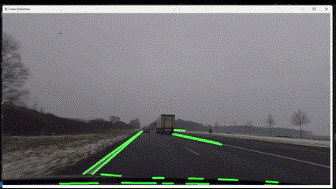

# OpenCV Projects Examples

Explore fundamental computer vision tasks with **OpenCV** through simple yet powerful projects! This repository includes examples and tutorials for common image processing techniques, from edge detection to object tracking.

## Demos

### Track The Selected Object


### Track All Objects


### Hand Gesture Recognition


### Lane Detection for Self-Driving Cars


### Augmented Reality (AR)


### Real Time Emotion Recognition
A project that
- uses Haar Cascade classifier for face detection.
- builds a CNN model for facial expression recognition (FER).

Check this [link](https://github.com/HoDangCao/Real-time-Emotion-Recognition) for more details.


## Project Overview

1. **Edge Detection**  
   Implement edge detection using the Canny algorithm to identify object boundaries.  
   - **Highlights**: Understanding image gradients, thresholding, and edge detection.

2. **Line Detection**  
   Use the Probabilistic Hough Line Transform to detect line segments in images.
   - **Highlights**: Line segment identification with adjustable parameters for accuracy.

3. **Contour Detection**  
   Identify and outline shapes using contours.
   - **Highlights**: Shape detection, hierarchical contouring, and applications in object recognition.

4. **Convex Hull Detection**  
   Find the convex hull of objects to recognize general shapes.
   - **Highlights**: Efficient shape detection with convex hulls, useful for identifying hand gestures and other shapes.

5. **Face Detection**  
   Use Haar Cascades for face detection in images.
   - **Highlights**: Real-time object detection with pretrained models for common objects like faces.

6. **Camera Pose Estimation**  
   Estimate the position and orientation of an object in 3D space relative to the camera.
   - **Highlights**: Real-world applications in AR and 3D modeling using Perspective-n-Point algorithms.

7. **Object Tracking**  
   Track objects in video feeds, either selected or all moving objects.
   - **Highlights**: Background subtraction, CamShift for single-object tracking, and Kalman filters for prediction.

8. **Hand Gesture Recognition**  
   Detect and classify hand gestures using contours and convex hulls.
   - **Highlights**: Gesture recognition for interactive applications.

## Getting Started

### Prerequisites
- **Python** 3.x
- **OpenCV** 4.x
- **NumPy** for numerical operations
- **Matplotlib** for visualizations (optional)

### Installation
Install the dependencies via pip:
```bash
pip install -r requirements.txt
```

## Projects Included
Each project includes detailed explanations, code comments, and adjustable parameters for experimentation. Check out the `notebook` for more deep understanding!

### Contributing
Feel free to contribute by adding more OpenCV-based projects or enhancing existing examples. Fork the repo, make your changes, and submit a pull request.

Happy coding! 🎉
